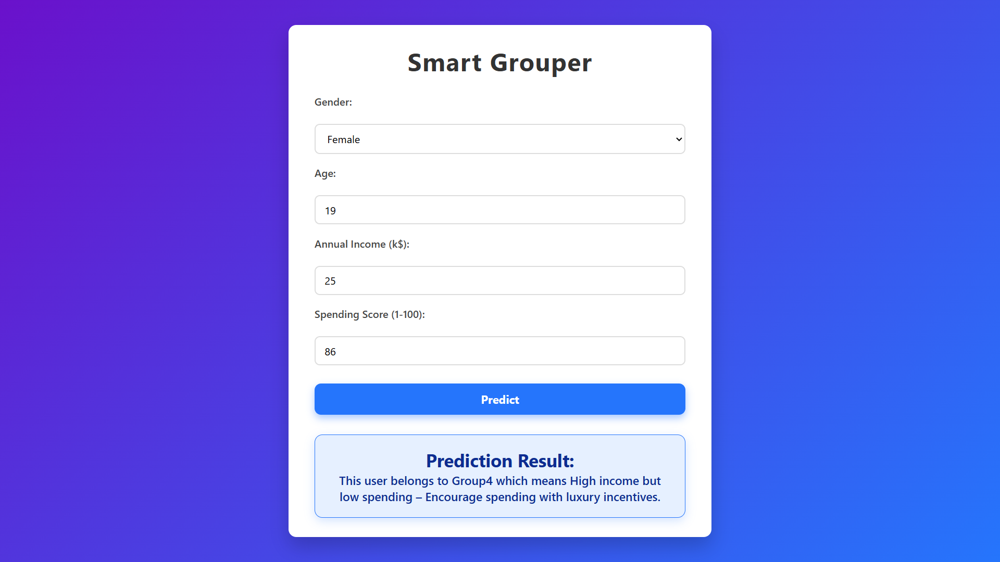

# 🛍️ Customer Segmentation with K-Means Clustering

This project implements customer segmentation for a retail store using **K-Means Clustering**. It analyzes customer characteristics such as **Age**, **Annual Income**, and **Spending Score**, and groups them into meaningful customer segments (e.g., VIPs, Budget Shoppers, Trendy Spenders).

## 📂 Project Structure

```
.
├── train and test/                # Jupyter Notebook(s) for training and testing the model
│   └── test_and_test.ipynb
├── model/                # Contains the trained model and the prediction logic
│   ├── kmeans_model.pkl
│   ├── scaler.pkl
│   └── predict_cluster.py
├── SegmaAI/              # Django web application to interact with the model
│   ├── views.py
│   ├── urls.py
│   ├── templates/
│   └── ...
├── requirements.txt      # Python dependencies
└── README.md             # Project documentation
```

## 🚀 How It Works

1. Customer data is collected (Age, Income, Spending Score).
2. The data is scaled using `StandardScaler`.
3. K-Means groups customers into **4 clusters** based on behavior.
4. The cluster is mapped to a business segment (e.g., VIP, Budget, etc.).
5. The Django web app allows user input and returns the predicted customer segment.

## 🌐 Try the App

Interact with the customer segmentation model through the Django web interface provided in the `SegmaAI` folder.

## 📸 Screenshot



## 📬 Contact

For any issues, suggestions, or queries, feel free to contact me via:  
🔗 [contact me](https://myporfolio-1o1h.onrender.com/contact)
